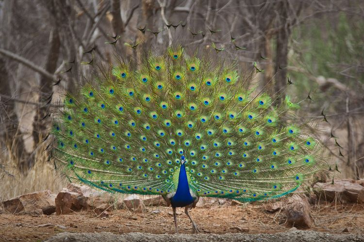
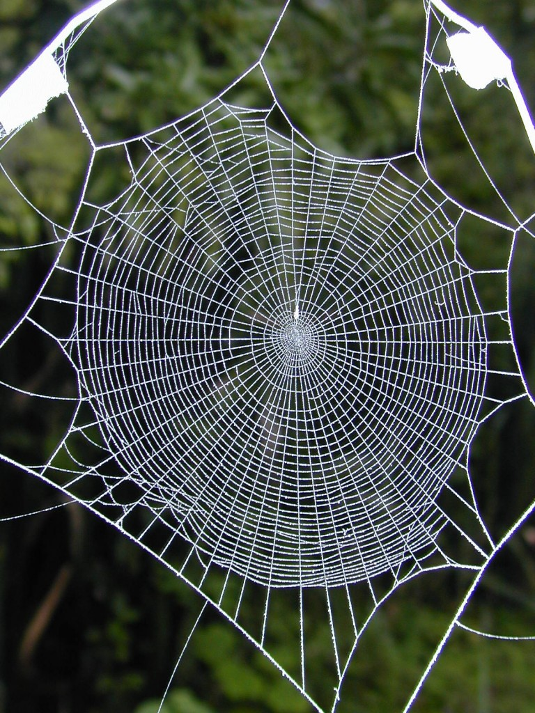
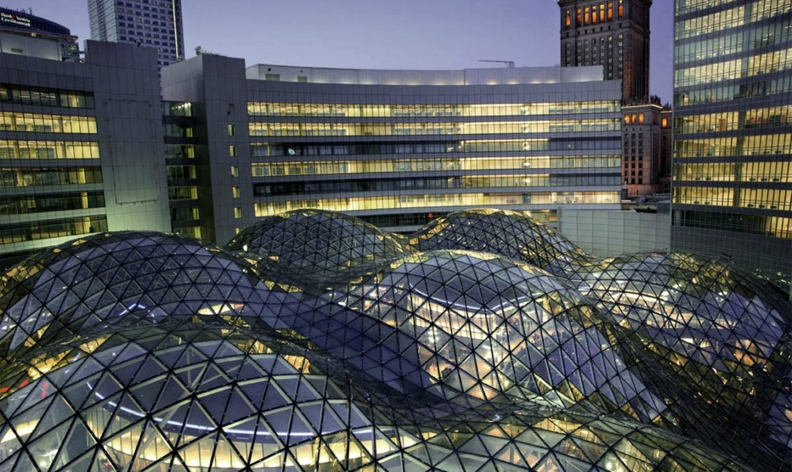
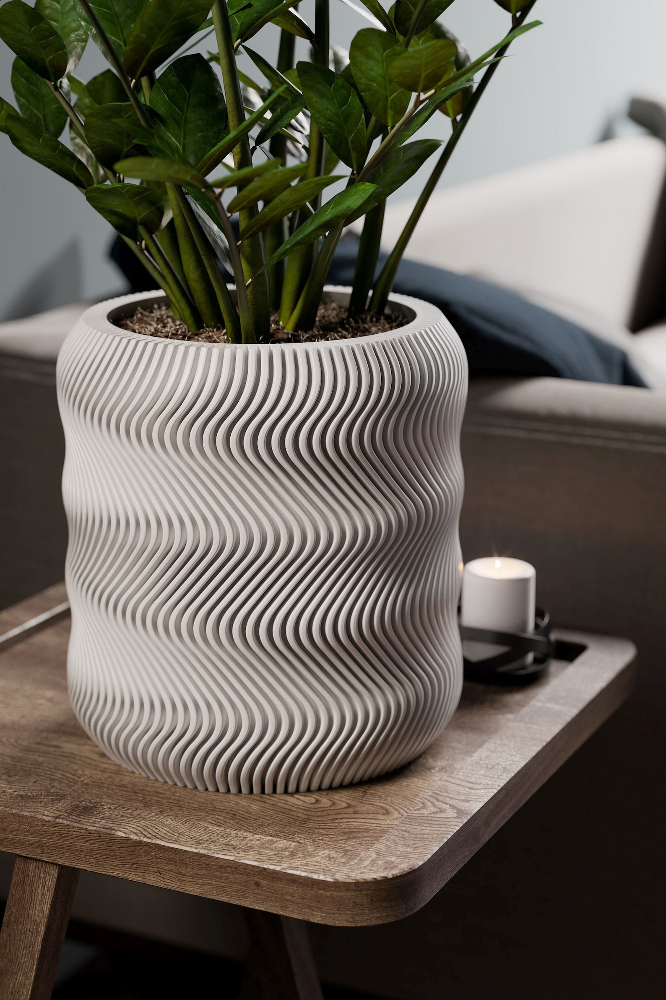
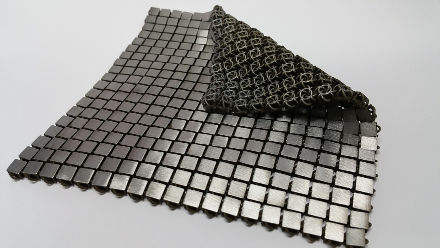
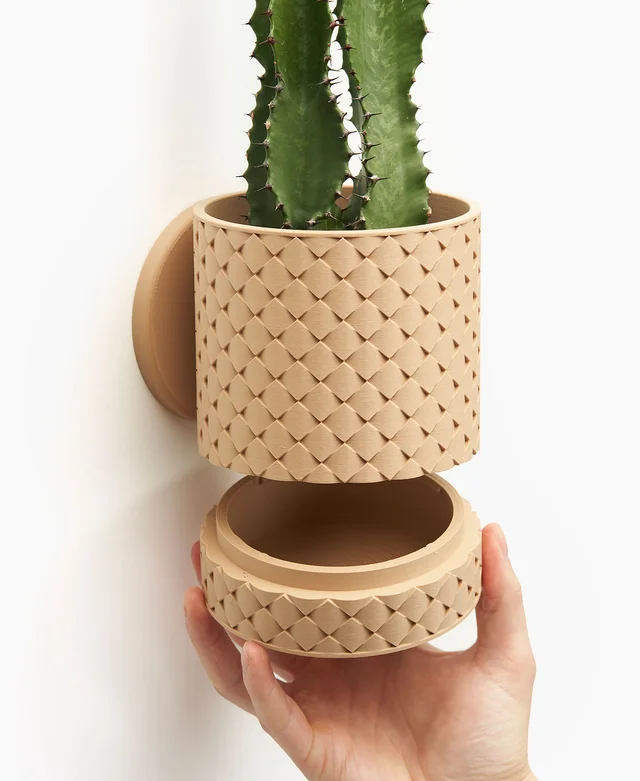

## Computational Design in Nature

_Botanical World_ Sunflowers exhibit a regular spiral pattern in the placement of their seeds. If you count the number of clockwise and counter-clockwise spirals, it will usually be a pair of numbers from Fibonacci sequence, e.g. 34 and 55 or 55 and 89. [^sunflower]

[^sunflower]: https://www.science.org/content/article/sunflowers-show-complex-fibonacci-sequences

_Zoological World_ Another example of the fibonacci appearing in nature. The peacock exhibits spiral patterns on its feathers that follow the Fibonacci sequence.

_Environment Built by Organisms_ Although the patterns of webs woven by spiders vary among species, most of them exhibit regular and symmetric patterns. The photo is an example of a web woven by the orb weaving spider A. bifurca. [^spider]

[^spider]: https://www.si.edu/stories/drugged-spiders-under-influence

## Computational Design in the Human-Made Built Environment

Zlote Tarasy in Warsaw is a triangular steel and glass structure representing cloth draped over spheres. It won the European Steel Design Award in 2007. I have seen it in person and it is quite breathtaking. [^zloty]

[^zloty]: https://www.wb-sg.com/projects/zlotetarasy/

3D printers have provided a very accessible way to create objects based on computational design. It provides a streamlined pipeline from designs generated on a computer to physical objects and often allows the creation of objects that would be difficult or impossible using more traditional manufacturing techniques.

Another example of an object that can only be practically made using 3D printing, this is a material made at NASA that exhibits traits of a fabric while being manufactured from solid metal. [^fabric]

[^fabric]: https://www.core77.com/posts/65465/NASAs-3D-Printed-Metallic-Fabric

## Designers/Researchers using Computational Design

Inigo Quilez is one of my favourite engineers/designers. You have probably seen his work on many occasions without realizing it. He has created backgrounds for animated films using custom rendering techniques that are much more computationally affordable than traditional mesh-based systems. He creates SDF-based geometries and renders them using ray marching. In the example above, the terrain is procedurally generated by sampling noise functions. His personal website showcasing his work as well as many fantastic articles can be found here: [iquilezles.org](https://iquilezles.org).

I am a fan of Hendricks Design (recently rebranded to LoftedGoods). They consistently are able to create 3d printed designs that blend interesting 3d patterns and classic design styles in an aesthetically pleasing way. From what I've seen in some of their videos, they generate most of their designs in Fusion360 using a blend of sweeps and lofts. Their instagram page with many of their designs can be found here: [loftedgoods](https://www.instagram.com/loftedgoods)
