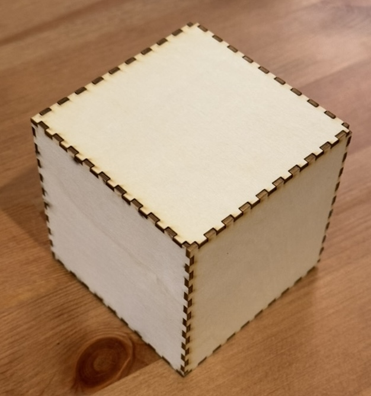
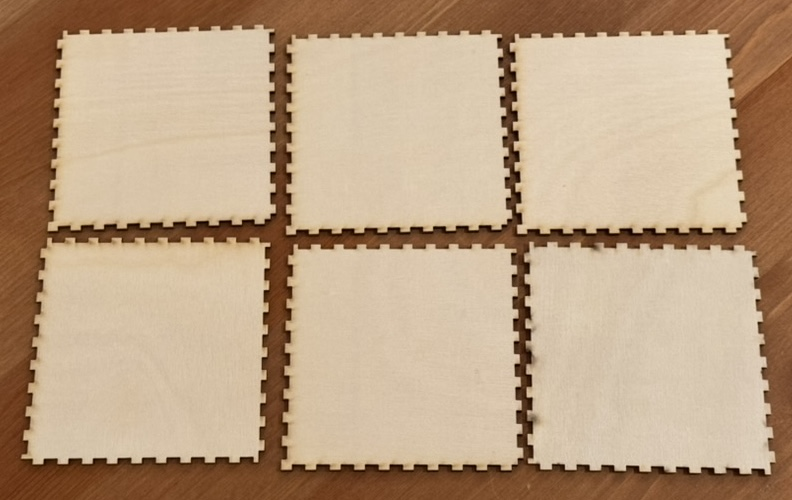
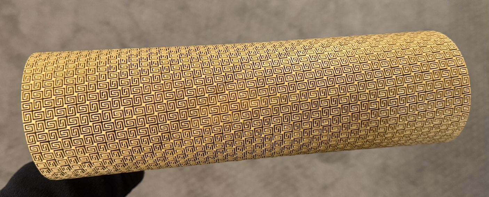
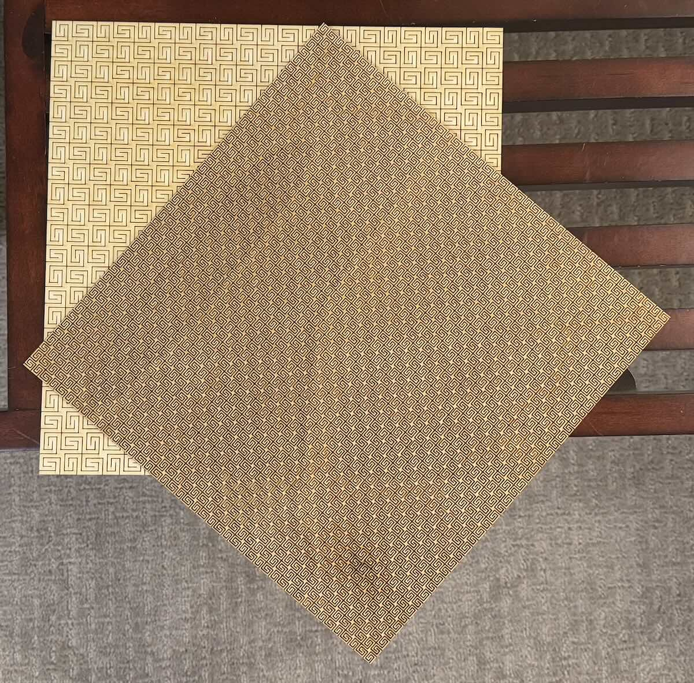
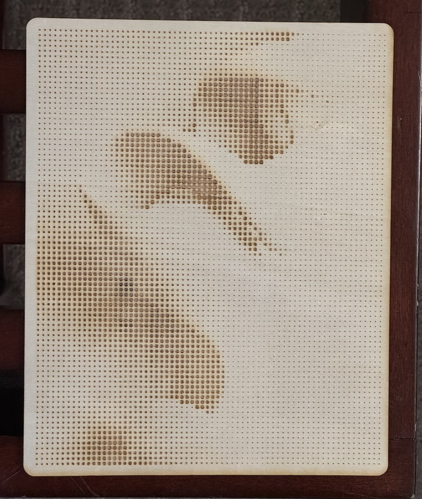
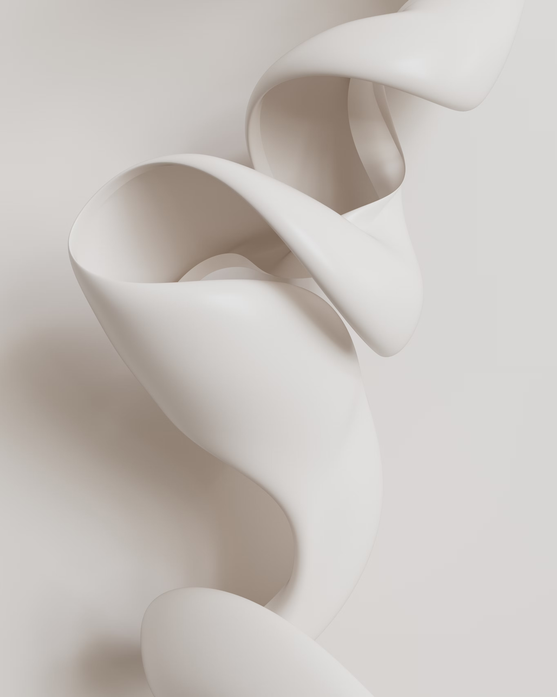
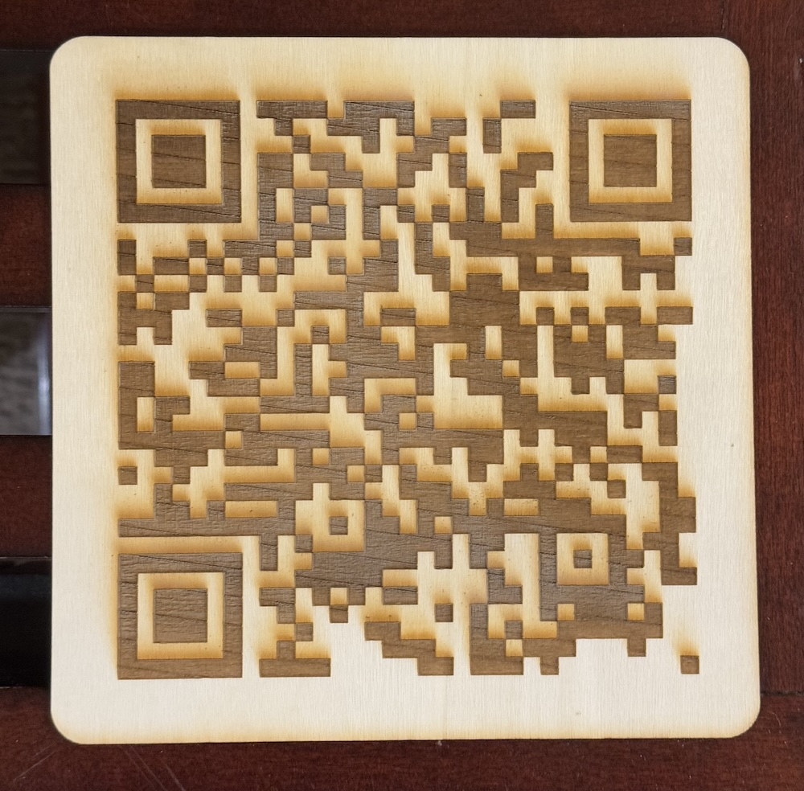
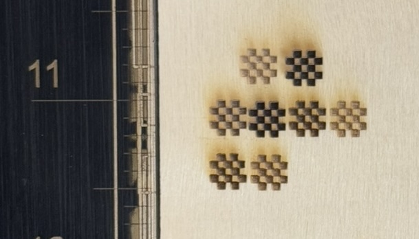

## Design #1: Box-Jointed Cube

For this first design, I made a box-jointed cube. It creates two basic patterns, a male and female joint, then places them rotated around a box. There are some overlapping cuts but those end up being irrelevant and greatly simplify the code as female-male pair joints do not need to be handled.





## Design #2: Flexible Plywood

My original intent for this design was to create a lamp using a single-curve flexible sheet. I quickly realized that the 12x12" stock I bought would not be big enough. While I was researching cutting techniques, I found this compound curve design which I thought was interesting and decided to reproduce [^fabric].

[^fabric]: https://www.instructables.com/Super-flexible-duble-curvature-surface-laser-cut-p/



The design is generated by repeating a base pattern in an alternating offset grid. The edges need to be filled in with a portion of the pattern[^pattern_aside].

My first attempt was too coarse to so I re-cut the piece with a twice as fine pattern.



[^pattern_aside]: Although this could be skipped as the remainder would just be cut off at the end.

## Design #3: Pointillism Raster

My first attempt at the raster portion was unsuccessful. I attempted to create a pointillism rendition of an abstract image, however, it ended up not looking very good. My code takes the source image, then overlays a grid at which it places circles sized based on the value of the image at that location.





## Design #4: QR Code

Since the pointillism raster did not work out, I tried another design. I made a QR code that points to this blog post.

